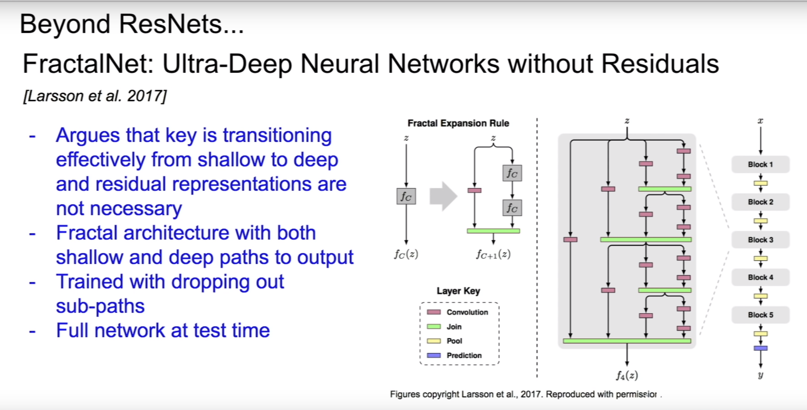

## Activation functions

### Sigmoid

$\textrm{sig}(x)=1/(1+e^{-x})$

Problems:

- vanishing gradient
- not zero centered (image is (0, 1))
  $(\textrm{I}) := \textrm{sigmoid}(\sum w_ix_i+b)$ is always all-positive, this causes the gradient updates all moving in the same direction.
  (not sure if this is the correct explanation:) The gradient of $(\textrm{I})$ (with respect to $w$) is $sigmoid'(\sum w_ix_i+b) * (\sum w_i x_i+b)'$ according to the chain rule. The first term $sigmoid'(\sum w_ix_i+b)$ is some arbitrary gradient, the gradient of $(\sum w_i x_i+b)$ is $x$. If $x$ is the output of a previous layer with sigmoid activation it is always all-positive.
- $\textrm{exp}()$ is computationally expensive

### tanh(x)

- zero centered

Problems:

- vanishing gradient

### ReLU

$\textrm{relu}(x) = \textrm{max}(0, x)$

- does not saturate
- very computationally efficient
- converges fast
- more biologically plausible

Problems:

- not zero centered
- no gradient for negative values → bad initialization can cause relus to be "dead", a too high learning rate can also cause values to jump around and relus to die

relu neurons can be initialized with slightly positive bias (e.g. 0.01) to decrease the likelihood of it being dead

### Leaky ReLU

$\textrm{relu}(x) = \textrm{max}(0.01x, x)$

will not die

### Parametric ReLU (PReLU)

$\textrm{relu}(x) = \textrm{max}(\alpha x, x)$

$\alpha$ is learned

### Exponential Linear Units (ELU)

$f(x) = \left\{
\begin{array}
{ll}
x & \textrm{if} \, x > 0 \\
\alpha (\textrm{exp}(x)-1) & \textrm{if} \, x \le 0 \\
\end{array}\right.$

- all benefits of relu
- closer to zero-mean outputs

Problems:

- more saturating than relus
- computationally expensive because of $\textrm{exp}()$

### Maxout Neuron

$\textrm{max}(w^T_1x+b_1, w^T_2x+b_2)$

- does not have the form of dot product, then linearity. Instead two sets of weights and biases
- generalizes ReLU and LeakyReLU
- Linear regime, does not die or saturate!

Problems:

- doubles the number of weights and biases

## Preprocessing

- zero-center and normalized (zero-center so that gradients are independent)

## Initialization

### w_i = 0 (all weights=0)

all neurons do the same operation and have the same gradient, then they update all in the same way → all neurons do essentially the same thing

### small random numbers `W = 0.01*np.random.randn(D, H)`

Works okay for small networks, in deeper networks since all values are multiplied by 0.01 at each layer the values get smaller and smaller until at the end of the network they are extremely tiny/zero. Same thing happens for gradients in the other direction → network doesn't learn

### large random numbers (e.g. randn around 1)

almost all neurons completely saturated with (tanh)

### Xavier initialization (Glorot et al., 2010)

```python
W = np.random.randn(fan_in, fan_out) / np.sqrt(fan_in) # layer initialization
```

- try to get the variance of the input to be the same as the variance of the output
- assumes linear activation (for example in the active region of tanh/sigmoid) → doesn't work with relu

To work with relu use this (note additional "/2") (He et al., 2015). This accounts for the 50% of neurons that are dead.
```python
W = np.random.randn(fan_in, fan_out) / np.sqrt(fan_in/2) # layer initialization
```

## Hyperparameter Search

- Optimize in log space! `lr = 10**uniform(-3, -6)`
  {0.001, 0.01, 0.1, 1} vs {0.001, 0.334, 0.667, 1}

- Use random search instead of grid search. Usually one variable is more important than the others, if we use random search we try many more different values for this important variable.
  


## Cross Validation


## Autodifferentiation

- split up computation in elementary operations ("gates" in the computation graoh) for which the local derivative is known
- chain the gradients of elementary operations together using the chain rule
- the elementary operations in the computation graph don't have to be atomic. For example the sigmoid function $\sigma(x)=\frac{1}{1+e^{-x}}$ has derivative $\frac{d\sigma}{dx}=\frac{e^{-x}}{(1+e^{-x})^2}=(1-\sigma(x))\sigma(x)$. As the derivative is very simple it might make sense to have the entire sigmoid function as a singular gate in the computation graph instead of chaining $e^x$, $\frac{1}{x}$, $x^2$,.. operations together.
- don't create the entire computation graph for the gradient. Just compute it directly

[http://cs231n.github.io/optimization-2/](http://cs231n.github.io/optimization-2/)

Some quotes:
"The point of this section is that the details of how the backpropagation is performed, and which parts of the forward function we think of as gates, is a matter of convenience. It helps to be aware of which parts of the expression have easy local gradients, so that they can be chained together with the least amount of code and effort."

"*Unintuitive effects and their consequences*. Notice that if one of the inputs to the multiply gate is very small and the other is very big, then the multiply gate will do something slightly unintuitive: it will assign a relatively huge gradient to the small input and a tiny gradient to the large input. Note that in linear classifiers where the weights are dot producted wTxiwTxi (multiplied) with the inputs, this implies that the scale of the data has an effect on the magnitude of the gradient for the weights. For example, if you multiplied all input data examples xixi by 1000 during preprocessing, then the gradient on the weights will be 1000 times larger, and you’d have to lower the learning rate by that factor to compensate. This is why preprocessing matters a lot, sometimes in subtle ways! And having intuitive understanding for how the gradients flow can help you debug some of these cases."

"We discussed the importance of **staged computation** for practical implementations of backpropagation. You always want to break up your function into modules for which you can easily derive local gradients, and then chain them with chain rule. Crucially, you almost never want to write out these expressions on paper and differentiate them symbolically in full, because you never need an explicit mathematical equation for the gradient of the input variables. Hence, decompose your expressions into stages such that you can differentiate every stage independently (the stages will be matrix vector multiplies, or max operations, or sum operations, etc.) and then backprop through the variables one step at a time."

## Gradient Descent

- mini batch size: "We use powers of 2 in practice because many vectorized operation implementations work faster when their inputs are sized in powers of 2."
- mini batches: "The reason this works well is that the examples in the training data are correlated. To see this, consider the extreme case where all 1.2 million images in ILSVRC are in fact made up of exact duplicates of only 1000 unique images (one for each class, or in other words 1200 identical copies of each image). Then it is clear that the gradients we would compute for all 1200 identical copies would all be the same, and when we average the data loss over all 1.2 million images we would get the exact same loss as if we only evaluated on a small subset of 1000."

### Problems with SGD

- Loss changes quickly in one direction and slowly in another (loss landscape looks like a taco shell) causes SGD to oscillate/jitter. Loss function is said to have a high *condition number* at this point (ratio of largest to smallest singular value of the Hessian matrix is large).
  Problem is worse in higher dimensions: If we have thousands or millions of singular values of the (much larger) hessian matrix the ratio of the largest to smallest one will be quite large.
- saddle points/local minima, some/all components of the gradient are zero → network doesn't learn. In practice local minima/maxima are very rare, instead saddle points are much more problematic since they are very common and the network doesn't learn very fast if many of the gradient's components are zero.

### SGD + Momentum, Nesterov Momentum

Many of the problems with SGD are solved by SGD+momentum. Momentum tracks "velocity" and applies friction $\rho$. This helps to avoid oscillations and accelerates traversal of local minima and saddle points.

Nesterov momentum uses lookahead position (after adding velocity) to compute gradient.
Formulation of NAG is a bit annoying since we usually want to compute the loss function and gradient at the same point. Change of variables fixes this

Does momentum causes us to skip over minima (when the minimum lies in a very narrow basin)?
Yes, but usually those sharp minima are minima that we want to avoid anyway because they lead to overfitting. If we increase our training set, those sharp minima may disappear, while large flat minima will remain.

### AdaGrad

``` python
grad_squared = 0
while True:
	dx = compute_gradient(x)
	grad_squared += dx*dx
	x -= lr * dx / (np.sqrt(grad_squared) + 1e-7)
```

Accelerates movement along dimensions of slow movement (weak gradient) and slows movement along dimensions of fast movement (strong gradient). Division by a large/small number.

Problem: grad_squared is never "reset" → step size decrease over the course of training

### RMSProp

fixed the problem with AdaGrad by decaying the grad_squared term

``` python
grad_squared = 0
while True:
	dx = compute_gradient(x)
	grad_squared += decay_rate * grad_squared + (1-decay_rate)*dx*dx
	x -= lr * dx / (np.sqrt(grad_squared) + 1e-7)
```

### Adam (almost/reduced version)

Momentum: build up velocity by adding averaging the gradients
AdaGrad & RMSProp: build up estimate of squared gradient and divide by those
Adam: combines both 

```python
first_moment = 0
second_moment = 0
while True:
	dx = compute_gradient(x)
	first_moment = beta1 * first_moment + (1+beta1) * dx # Momentum
    second_moment = beta2 * second_moment + (1-beta2) * dx*dx
	x -= lr * first_moment / (np.sqrt(second_moment) + 1e-7)
```

Problem: At the first training steps first and second moment estimates are still close to zero. This causes us to take too large steps in the beginning. (because of the division by sqrt second_moment)

**Full Adam** adds bias correction to fix this:

```python
first_moment = 0
second_moment = 0
for t in range(num_iterations):
	dx = compute_gradient(x)
	first_moment = beta1 * first_moment + (1+beta1) * dx # Momentum
    second_moment = beta2 * second_moment + (1-beta2) * dx*dx # AdaGrad/RMSProp
    first_unbias = first_moment / (1-beta1 ** t)
    second_unbias = second_moment / (1-beta2 ** t)
	x -= lr * first_unbias / (np.sqrt(second_unbias) + 1e-7)
```

One problem with Adam:
The taco shell optimization landscape problem above (under "problems with sgd") is only partly fixed by adam. Specifically only in cases where the "taco shell axes" are aligned with coordinate axes. In other cases where the valley is rotated Adam still has the same problem.

## Learning rate decay

Common with sgd/momentum, less commonly used with adam.

### Exponential Decay

$\alpha = \alpha_0 e^{-kt}$

### 1/t decay

$\alpha = \alpha_0/(1+kt)$

### step decay

e.g. decay learning rate by half every few epochs

## Second-Order Optimization

We can use higher order derivatives instead of only the first one. This has some advantages (we don't necessarily need a learning rate since we can directly step to the minimum of our quadratic approximation) but is very computationally expensive.

Hessian Matrix for Newton parameter update has O(n^2) elements, inverting takes O(n^3)

Instead there are less expensive versions

- Quasi-Newton methods (BGFS)
- L-BFGS (Limited memory BFGS)
  (works well with full batch deterministic gd but not in the stochastic min-batch setting)

## Model Ensembles

1. Train multiple independent models (possibly with different hyperparameters)
2. At test time average their results

→ A few percent higher performance

Alternatively:

- take multiple snapshots of a single model during training and average those snapshots in an ensemble (maybe with extreme learning rate schedule to explore different regions of the parameter space within the same training run)
- Polyak averaging


## Regularization

### Dropout

- Distributes representation over many more neurons, network doesn't become dependent on any single neuron
- Large ensemble of models within a single model

At test time we want to remove the stochasticity of dropout:


Instead approximate this by multiplying by dropout probability to rescale all activations.
"Drop at train time, scale at test time"

### Data Augmentation

Transform images/data in such a way that the label is preserved

- Horizontal Flips
- Random crops and scales
- Color jitter for contrast & brightness (more advanced with PCA to determine direction of jitter)
- translation/rotation/stretching/shearing/lens distortions...

### DropConnect

Instead of randomly zeroing out neuron activations, zero out some of the values in the weight matrix instead.

### Fractional Max Pooling

Use multiple different pooling maps for each pooling layer


### Stochastic Depth

During training drop some layers


### Batch Normalization (Ioffe and Szegedy, 2015)

"We want gaussian activations → just make them so"

Normalize by empirical mean and variance (independently for each dimension, applied batch-wise).

Can be applied to fully connected and convolutional layers. In convolutional layers we normalize across all spatial locations. (For conv only one scalar mean and variance, for fully connected possibly one scalar mean and variance for each feature)

BN avoids saturation, but maybe we want some saturation? Add parameters $\beta$  and $\gamma$ to control mean and variance. In this way we don't simply normalize the layer output but instead give the layer explicit control over it's output's mean and variance. (layer can just recover identity mapping) 

- improves gradient flow through the network
- allows higher learning rates
- reduces strong dependence on initialization
- acts as regularization since each image (/item) is dependent on all other items in the batch. (since the normalization is done per batch). "It is no longer producing deterministic values for a given training example and is tying all of the inputs in a batch together" 


## Why should data everywhere in the network (and during preprocessing) be normalized?


## CNN Architectures


- **LeNet-5:** one of the first convnets that was successfully used in practice (standard conv, pool, ... , fc architecture)
- **AlexNet:** first large scale convnet that won imagenet competition. Architecture similar to LeNet, first use of ReLU, used dropout & data augmentation, SGD+momentum, l2 weight decay, 7-CNN ensemble
- **VGGNet:** (VGG16, VGG19 with 16 and 19 layers respectively), won imagenet, very small conv filters (3x3, 5x5). Stacker smaller filter are less computationally expensive but have the same effective receptive field.
  
- **GoogLeNet:** 2014 winner, introduced inception module, no fc layers, 12x less parameters than alexnet
- **ResNet:** much deeper than any previous model: 152 layers, 2015 winner, residual connections make it easier to recover the identity mapping (and more explicit), batchnorm, xavier:2 init, sgd+momentum, weight decay, no dropout used, learning rate schedule
  
  - Residual Blocks and L2 normalization: l2 normalization encourages weights to be close to zero, this might not actually make a lot of sense with normal convnets but with resnets this causes unused layers to just become identity mappings. 
  - Think of what happens with the gradient at "additive gates". The gradient is the sum of the gradients of both branches.

Other architectures:

- **"Network in Network"**
- **"Identity Mappings in Deep Residual Networks":** improved ResNet block design
- **"Wide Residual Networks":** Argues that residuals are the important factor, not depth. Uses wider residual blocks and fewer layers. 50-layer wide ResNet outperforms 152-layer original ResNet. Increasing width instead of depth is more computationally efficient (parallelizable)
- **"Aggregated Residual Transformations for Deep Neural Networks (ResNeXt)":** multiple parallel pathways within a residual block
  
- **"Deep Networks with Stochastic Depth":** Motivation: reduce vanishing gradients and training time through shallower networks during training. Like dropout but for entire layers. Use full network at test time.
- **"FractalNet: Ultra-Deep Neural Networks without Residuals":** argues that key is transitioning effectively from shallow to deep and residual representations are not necessary. Fractal architecture with both shallow and deep paths to output. Trained with dropping out sub-paths, full network at test time
  
- **DenseNet "Densely Connected Convolutional Networks":** dense blocks where each layer is connected to every other layer in feedforward fashion. Alleviates vanishing gradient, strengthens feature propagation, encourages feature reuse
  
- **"SqueezeNet: AlexNet-level Accuracy with 50x Fewer Parameters and <0.5Mb Model Size"**  

Number of layers of a network: generally given as the number of weight layers (conv, fc)

## RNNs

Current state $h_t$, state transition function $f_W$, current input $x_t$, current output $y_t$. The recurrence relation is of the form:

$h_t=f_W(h_{t-1}, x_t)$

for example:

$h_t=\tanh(W_{hh}h_{t-1}+W_{xh}x_t)$
$y_t=W_{hy}h_t$

