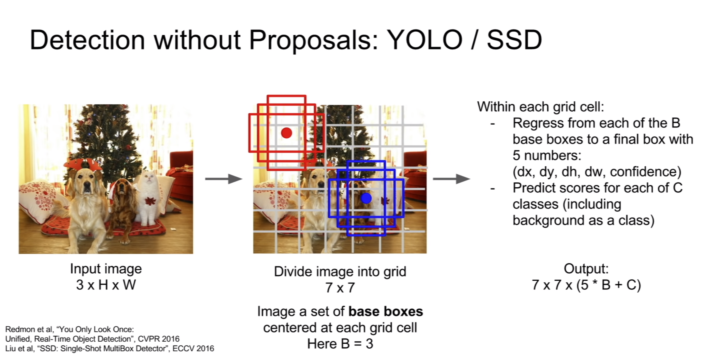
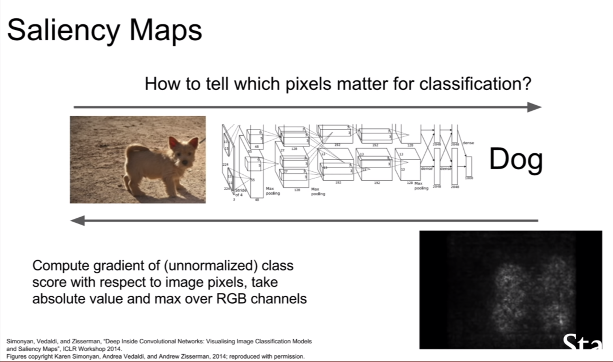
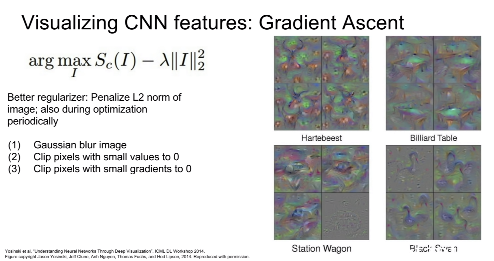

## Activation functions

### Sigmoid

$\textrm{sig}(x)=1/(1+e^{-x})$

Problems:

- vanishing gradient
- not zero centered (image is (0, 1))
  $(\textrm{I}) := \textrm{sigmoid}(\sum w_ix_i+b)$ is always all-positive, this causes the gradient updates all moving in the same direction.
  (not sure if this is the correct explanation:) The gradient of $(\textrm{I})$ (with respect to $w$) is $sigmoid'(\sum w_ix_i+b) * (\sum w_i x_i+b)'$ according to the chain rule. The first term $sigmoid'(\sum w_ix_i+b)$ is some arbitrary gradient, the gradient of $(\sum w_i x_i+b)$ is $x$. If $x$ is the output of a previous layer with sigmoid activation it is always all-positive.
- $\textrm{exp}()$ is computationally expensive

### tanh(x)

- zero centered

Problems:

- vanishing gradient

### ReLU

$\textrm{relu}(x) = \textrm{max}(0, x)$

- does not saturate
- very computationally efficient
- converges fast
- more biologically plausible

Problems:

- not zero centered
- no gradient for negative values → bad initialization can cause relus to be "dead", a too high learning rate can also cause values to jump around and relus to die

relu neurons can be initialized with slightly positive bias (e.g. 0.01) to decrease the likelihood of it being dead

### Leaky ReLU

$\textrm{relu}(x) = \textrm{max}(0.01x, x)$

will not die

### Parametric ReLU (PReLU)

$\textrm{relu}(x) = \textrm{max}(\alpha x, x)$

$\alpha$ is learned

### Exponential Linear Units (ELU)

$f(x) = \left\{
\begin{array}
{ll}
x & \textrm{if} \, x > 0 \\
\alpha (\textrm{exp}(x)-1) & \textrm{if} \, x \le 0 \\
\end{array}\right.$

- all benefits of relu
- closer to zero-mean outputs

Problems:

- more saturating than relus
- computationally expensive because of $\textrm{exp}()$

### Maxout Neuron

$\textrm{max}(w^T_1x+b_1, w^T_2x+b_2)$

- does not have the form of dot product, then linearity. Instead two sets of weights and biases
- generalizes ReLU and LeakyReLU
- Linear regime, does not die or saturate!

Problems:

- doubles the number of weights and biases

## Advanced Loss Functions [ref](http://cs231n.github.io/neural-networks-2/)

### Hierarchical Softmax

Decomposes labels into a tree, where each label is a path along the tree. A softmax classifier is trained at every node of the tree to select either the left or right branch.

### Multi -label/-attribute/-tag loss

- binary classifier for each category
- logistic regression classifier for every attribute

## Preprocessing

- zero-center and normalized (zero-center so that gradients are independent)

## Initialization

### w_i = 0 (all weights=0)

all neurons do the same operation and have the same gradient, then they update all in the same way → all neurons do essentially the same thing

### small random numbers `W = 0.01*np.random.randn(D, H)`

Works okay for small networks, in deeper networks since all values are multiplied by 0.01 at each layer the values get smaller and smaller until at the end of the network they are extremely tiny/zero. Same thing happens for gradients in the other direction → network doesn't learn

### large random numbers (e.g. randn around 1)

almost all neurons completely saturated with (tanh)

### Xavier initialization (Glorot et al., 2010)

```python
W = np.random.randn(fan_in, fan_out) / np.sqrt(fan_in) # layer initialization
```

- try to get the variance of the input to be the same as the variance of the output
- assumes linear activation (for example in the active region of tanh/sigmoid) → doesn't work with relu

To work with relu use this (note additional "/2") (He et al., 2015). This accounts for the 50% of neurons that are dead.
```python
W = np.random.randn(fan_in, fan_out) / np.sqrt(fan_in/2) # layer initialization
```

## Hyperparameter Search

- Optimize in log space! `lr = 10**uniform(-3, -6)`
  {0.001, 0.01, 0.1, 1} vs {0.001, 0.334, 0.667, 1}

- Use random search instead of grid search. Usually one variable is more important than the others, if we use random search we try many more different values for this important variable.
  


## Cross Validation


## Autodifferentiation

- split up computation in elementary operations ("gates" in the computation graoh) for which the local derivative is known
- chain the gradients of elementary operations together using the chain rule
- the elementary operations in the computation graph don't have to be atomic. For example the sigmoid function $\sigma(x)=\frac{1}{1+e^{-x}}$ has derivative $\frac{d\sigma}{dx}=\frac{e^{-x}}{(1+e^{-x})^2}=(1-\sigma(x))\sigma(x)$. As the derivative is very simple it might make sense to have the entire sigmoid function as a singular gate in the computation graph instead of chaining $e^x$, $\frac{1}{x}$, $x^2$,.. operations together.
- don't create the entire computation graph for the gradient. Just compute it directly

[http://cs231n.github.io/optimization-2/](http://cs231n.github.io/optimization-2/)

Some quotes:
"The point of this section is that the details of how the backpropagation is performed, and which parts of the forward function we think of as gates, is a matter of convenience. It helps to be aware of which parts of the expression have easy local gradients, so that they can be chained together with the least amount of code and effort."

"*Unintuitive effects and their consequences*. Notice that if one of the inputs to the multiply gate is very small and the other is very big, then the multiply gate will do something slightly unintuitive: it will assign a relatively huge gradient to the small input and a tiny gradient to the large input. Note that in linear classifiers where the weights are dot producted wTxiwTxi (multiplied) with the inputs, this implies that the scale of the data has an effect on the magnitude of the gradient for the weights. For example, if you multiplied all input data examples xixi by 1000 during preprocessing, then the gradient on the weights will be 1000 times larger, and you’d have to lower the learning rate by that factor to compensate. This is why preprocessing matters a lot, sometimes in subtle ways! And having intuitive understanding for how the gradients flow can help you debug some of these cases."

"We discussed the importance of **staged computation** for practical implementations of backpropagation. You always want to break up your function into modules for which you can easily derive local gradients, and then chain them with chain rule. Crucially, you almost never want to write out these expressions on paper and differentiate them symbolically in full, because you never need an explicit mathematical equation for the gradient of the input variables. Hence, decompose your expressions into stages such that you can differentiate every stage independently (the stages will be matrix vector multiplies, or max operations, or sum operations, etc.) and then backprop through the variables one step at a time."

## Gradient Descent

- mini batch size: "We use powers of 2 in practice because many vectorized operation implementations work faster when their inputs are sized in powers of 2."
- mini batches: "The reason this works well is that the examples in the training data are correlated. To see this, consider the extreme case where all 1.2 million images in ILSVRC are in fact made up of exact duplicates of only 1000 unique images (one for each class, or in other words 1200 identical copies of each image). Then it is clear that the gradients we would compute for all 1200 identical copies would all be the same, and when we average the data loss over all 1.2 million images we would get the exact same loss as if we only evaluated on a small subset of 1000."

### Problems with SGD

- Loss changes quickly in one direction and slowly in another (loss landscape looks like a taco shell) causes SGD to oscillate/jitter. Loss function is said to have a high *condition number* at this point (ratio of largest to smallest singular value of the Hessian matrix is large).
  Problem is worse in higher dimensions: If we have thousands or millions of singular values of the (much larger) hessian matrix the ratio of the largest to smallest one will be quite large.
- saddle points/local minima, some/all components of the gradient are zero → network doesn't learn. In practice since in high-dim spaces local minima/maxima are very rare, saddle points are much more problematic since they are very common and the network doesn't learn very fast if many of the gradient's components are zero.

### SGD + Momentum, Nesterov Momentum

Many of the problems with SGD are solved by SGD+momentum. Momentum tracks "velocity" and applies friction $\rho$. This helps to avoid oscillations and accelerates traversal of local minima and saddle points.

Nesterov momentum uses lookahead position (after adding velocity) to compute gradient.
Formulation of NAG is a bit annoying since we usually want to compute the loss function and gradient at the same point. Change of variables fixes this

Does momentum causes us to skip over minima (when the minimum lies in a very narrow basin)?
Yes, but usually those sharp minima are minima that we want to avoid anyway because they lead to overfitting. If we increase our training set, those sharp minima may disappear, while large flat minima will remain.

### AdaGrad

``` python
grad_squared = 0
while True:
	dx = compute_gradient(x)
	grad_squared += dx*dx
	x -= lr * dx / (np.sqrt(grad_squared) + 1e-7)
```

Accelerates movement along dimensions of slow movement (weak gradient) and slows movement along dimensions of fast movement (strong gradient). Division by a large/small number.

Problem: grad_squared is never "reset" → step size decrease over the course of training

### RMSProp

fixed the problem with AdaGrad by decaying the grad_squared term

``` python
grad_squared = 0
while True:
	dx = compute_gradient(x)
	grad_squared = decay_rate * grad_squared + (1-decay_rate)*dx*dx
	x -= lr * dx / (np.sqrt(grad_squared) + 1e-7)
```

### Adam

Momentum: build up velocity by adding averaging the gradients
AdaGrad & RMSProp: build up estimate of squared gradient and divide by those
Adam: combines both

Adam without bias correction:

```python
first_moment = 0
second_moment = 0
while True:
	dx = compute_gradient(x)
	first_moment = beta1 * first_moment + (1+beta1) * dx # Momentum
    second_moment = beta2 * second_moment + (1-beta2) * dx*dx
	x -= lr * first_moment / (np.sqrt(second_moment) + 1e-7)
```

Problem: At the first training steps first and second moment estimates are still close to zero. This causes us to take too large steps in the beginning. (because of the division by sqrt second_moment)

**Full Adam** adds bias correction to fix this:

```python
first_moment = 0
second_moment = 0
for t in range(num_iterations):
	dx = compute_gradient(x)
	first_moment = beta1 * first_moment + (1+beta1) * dx # Momentum
    second_moment = beta2 * second_moment + (1-beta2) * dx*dx # AdaGrad/RMSProp
    first_unbias = first_moment / (1-beta1 ** t)
    second_unbias = second_moment / (1-beta2 ** t)
	x -= lr * first_unbias / (np.sqrt(second_unbias) + 1e-7)
```

One problem with Adam:
The taco shell optimization landscape problem above (under "problems with sgd") is only partly fixed by adam. Specifically only in cases where the "taco shell axes" are aligned with coordinate axes. In other cases where the valley is rotated Adam still has the same problem.

## Learning rate decay

Common with sgd/momentum, less commonly used with adam.

### Exponential Decay

$\alpha = \alpha_0 e^{-kt}$

### 1/t decay

$\alpha = \alpha_0/(1+kt)$

### step decay

e.g. decay learning rate by half every few epochs

## Second-Order Optimization

We can use higher order derivatives instead of only the first one. This has some advantages (we don't necessarily need a learning rate since we can directly step to the minimum of our quadratic approximation) but is very computationally expensive.

Hessian Matrix for Newton parameter update has O(n^2) elements, inverting takes O(n^3)

Instead there are less expensive versions

- Quasi-Newton methods (BGFS)
- L-BFGS (Limited memory BFGS)
  (works well with full batch deterministic gd but not in the stochastic min-batch setting)

## Model Ensembles

1. Train multiple independent models (possibly with different hyperparameters)
2. At test time average their results

→ A few percent higher performance

Alternatively:

- take multiple snapshots of a single model during training and average those snapshots in an ensemble (maybe with extreme learning rate schedule to explore different regions of the parameter space within the same training run)
- Polyak averaging


## Regularization

### L2 Regularization

"The L2 regularization has the intuitive interpretation of heavily penalizing peaky weight vectors and preferring diffuse weight vectors. As we discussed in the Linear Classification section, due to multiplicative interactions between weights and inputs this has the appealing property of encouraging the network to use all of its inputs a little rather than some of its inputs a lot. Lastly, notice that during gradient descent parameter update, using the L2 regularization ultimately means that every weight is decayed linearly: `W += -lambda * W` towards zero."[ref](http://cs231n.github.io/neural-networks-2/#reg)

### L1 Regularization

"The L1 regularization has the intriguing property that it leads the weight vectors to become sparse during optimization (i.e. very close to exactly zero). In other words, neurons with L1 regularization end up using only a sparse subset of their most important inputs and become nearly invariant to the “noisy” inputs. In comparison, final weight vectors from L2 regularization are usually diffuse, small numbers. In practice, if you are not concerned with explicit feature selection, L2 regularization can be expected to give superior performance over L1." [ref](http://cs231n.github.io/neural-networks-2/#reg)

### Dropout

- Distributes representation over many more neurons, network doesn't become dependent on any single neuron
- Large ensemble of models within a single model

At test time we want to remove the stochasticity of dropout:


Instead approximate this by multiplying by dropout probability to rescale all activations.
"Drop at train time, scale at test time"


**Inverted Dropout:** Drop and scale at train time, don't do anything at test time.

### Bias regularization

Uncommon since bias parameters don't interact with the data multiplicatively, therefore don't control how individual data dimensions influence the final output


### Data Augmentation

Transform images/data in such a way that the label is preserved

- Horizontal Flips
- Random crops and scales
- Color jitter for contrast & brightness (more advanced with PCA to determine direction of jitter)
- translation/rotation/stretching/shearing/lens distortions...

### DropConnect

Instead of randomly zeroing out neuron activations, zero out some of the values in the weight matrix instead.

### Fractional Max Pooling

Use multiple different pooling maps for each pooling layer


### Stochastic Depth

During training drop some layers


### Batch Normalization (Ioffe and Szegedy, 2015)

"We want gaussian activations → just make them so"

Normalize by empirical mean and variance (independently for each dimension, applied batch-wise).

Can be applied to fully connected and convolutional layers. In convolutional layers we normalize across all spatial locations. (For conv only one scalar mean and variance, for fully connected possibly one scalar mean and variance for each feature)

BN avoids saturation, but maybe we want some saturation? Add parameters $\beta$  and $\gamma$ to control mean and variance. In this way we don't simply normalize the layer output but instead give the layer explicit control over it's output's mean and variance. (layer can just recover identity mapping) 

- improves gradient flow through the network
- allows higher learning rates
- reduces strong dependence on initialization
- acts as regularization since each image (/item) is dependent on all other items in the batch. (since the normalization is done per batch). "It is no longer producing deterministic values for a given training example and is tying all of the inputs in a batch together" 


## Why should data everywhere in the network (and during preprocessing) be normalized?


## CNN Architectures


- **LeNet-5:** one of the first convnets that was successfully used in practice (standard conv, pool, ... , fc architecture)
- **AlexNet:** first large scale convnet that won imagenet competition. Architecture similar to LeNet, first use of ReLU, used dropout & data augmentation, SGD+momentum, l2 weight decay, 7-CNN ensemble
- **VGGNet:** (VGG16, VGG19 with 16 and 19 layers respectively), won imagenet, very small conv filters (3x3, 5x5). Stacker smaller filter are less computationally expensive but have the same effective receptive field.
  
- **GoogLeNet:** 2014 winner, introduced inception module, no fc layers, 12x less parameters than alexnet
- **ResNet:** much deeper than any previous model: 152 layers, 2015 winner, residual connections make it easier to recover the identity mapping (and more explicit), batchnorm, xavier:2 init, sgd+momentum, weight decay, no dropout used, learning rate schedule
  
  - Residual Blocks and L2 normalization: l2 normalization encourages weights to be close to zero, this might not actually make a lot of sense with normal convnets but with resnets this causes unused layers to just become identity mappings. 
  - Think of what happens with the gradient at "additive gates". The gradient is the sum of the gradients of both branches.

Other architectures:

- **"Network in Network"**
- **"Identity Mappings in Deep Residual Networks":** improved ResNet block design
- **"Wide Residual Networks":** Argues that residuals are the important factor, not depth. Uses wider residual blocks and fewer layers. 50-layer wide ResNet outperforms 152-layer original ResNet. Increasing width instead of depth is more computationally efficient (parallelizable)
- **"Aggregated Residual Transformations for Deep Neural Networks (ResNeXt)":** multiple parallel pathways within a residual block
  
- **"Deep Networks with Stochastic Depth":** Motivation: reduce vanishing gradients and training time through shallower networks during training. Like dropout but for entire layers. Use full network at test time.
- **"FractalNet: Ultra-Deep Neural Networks without Residuals":** argues that key is transitioning effectively from shallow to deep and residual representations are not necessary. Fractal architecture with both shallow and deep paths to output. Trained with dropping out sub-paths, full network at test time
  
- **DenseNet "Densely Connected Convolutional Networks":** dense blocks where each layer is connected to every other layer in feedforward fashion. Alleviates vanishing gradient, strengthens feature propagation, encourages feature reuse
  
- **"SqueezeNet: AlexNet-level Accuracy with 50x Fewer Parameters and <0.5Mb Model Size"**  

Number of layers of a network: generally given as the number of weight layers (conv, fc)

## RNNs

Current state $h_t$, state transition function $f_W$, current input $x_t$, current output $y_t$. The recurrence relation is of the form:

$h_t=f_W(h_{t-1}, x_t)$

for example:

$h_t=\tanh(W_{hh}h_{t-1}+W_{xh}x_t)$
$y_t=W_{hy}h_t$

or with biases:

$h_t=\tanh(W_{hh}h_{t-1}+W_{xh}x_t+b_h)$
$y_t=W_{hy}h_t+b_y$

(Using $\tanh$ generally causes the vanishing gradient problem but avoids the problem that unbounded activations in RNNs may explode[fn](https://www.reddit.com/r/MachineLearning/comments/9elxs8/d_why_do_you_use_tanh_in_a_rnn/)[fn](https://stackoverflow.com/questions/40761185/what-is-the-intuition-of-using-tanh-in-lstm))


One-to-one, one-to-many, many-to-one, many-to-one architectures
**Sequence to sequence**: Many-to-one encoder + One-to-many decoder

### Char-level RNN

Generating text with a char-level rnn:

- Feed initial primer/prompt through the network
- At each step apply softmax to output and sample from the resulting probability distribution. Then feed this back into the network as input.
  (Instead of sampling we could also take the argmax which may increase stability but reduces sample diversity)

**[char-level rnn example: karpathy/min-char-rnn.py](https://gist.github.com/karpathy/d4dee566867f8291f086)**
What are **unnormalized log probabilities** in min-char-rnn.py? [See this](https://stackoverflow.com/questions/48483980/why-explain-logit-as-unscaled-log-probabililty-in-sotfmax-cross-entropy-with-l)
The softmax function is $\exp{z_k}/\sum_i{\exp{z_i}}$. $z$ are called the unnormalized log probabilities because they are not yet normalized by $\sum_i{\exp{z_i}}$ and $z_k = \log (\exp z_k)$.

```python
ys[t] = np.dot(Why, hs[t]) + by # unnormalized log probabilities for next chars
    ps[t] = np.exp(ys[t]) / np.sum(np.exp(ys[t])) # probabilities for next chars
```

### Backpropagation through time

Forward pass through entire sequence to compute loss, backward pass through entire sequence to compute gradient

**Truncated BPTT:** Forward and backward through smaller chunks of the whole sequence (carry over hidden state from previous chunk to the beginning of the next chunk)


### Image Captioning

Feed image through convnet (for example inceptionv4 without the last two layers) to get a feature vector $v$. Then run an rnn with the hidden state recurrence relation $h_t=\tanh(W_{hh}h_{t-1}+W_{xh}x_t+W_{ih}v)$ which incorporates the image information at every timestep. (Alternatively just use the feature vector as the initial hidden state of a language model rnn instead of the changed recurrence relation)

### Image Captioning with Attention

Instead of a single feature vector for the entire image, the convnet now extracts one feature vector for each patch of the image (e.g. 14x14 feature map for a 300x300px image), which is then fed into the lstm language model. In addition to the vocabulary prob. distribution the lstm model also outputs an (attention) distribution over all locations in the image. As the next input the model then receives the word/char sampled from the first prob. distr. and the (14x14) feature vector map weighted by the attention distribution.


**Soft-attention:** weighted combination of features from all image locations
**Hard attention:** Select exactly one location in the image to look at


Hard-attention is not differentiable. "Need to use something slightly fancier than vanilla backprob."

**Visual question answering**: use rnn to summarize question, cnn to summarize image, then use another rnn to generate answer based on both summaries.

**Multilayer RNNs:** hidden states from one rnn (one for each timestep) are passed to another rnn

### Vanilla RNN Gradient Flow

When backpropping through matrix multiply with $W$ we multiply by the transpose of $W$. Therefore in a deep RNN when computing the gradient we have repeated multiplication by W and application of tanh. This could cause our gradients to either explode or vanish.
If $W$ is a scalar then the gradient explodes or vanishes depending on whether $W > 1$ or $W < 1$. In the non-scalar case it depends on whether the largest singular value $> 1$ or $< 1$.

Slight hack to fix exploding gradients: **gradient clipping**

```python
grad_norm = np.sum(grad*grad)
if grad_norm > threshold:
    grad *= (threshold / grad_norm)
```

(grad_norm might be the l2 norm)

### Long Short Term Memory (LSTM)

explicit forget, input, update gates

better gradient flow: gradient flows through forget gate operation but this can be different for each timestep so we are not repeatedly multiplying by the same matrix. Also the forget gate is also in the range [0, 1] due to the sigmoid. Furthermore we have no non-linearity in the gradient path.

**GRU:** LSTM variant

## Detection and Segmentation


### Semantic Segmentation

Task: Classify every pixel of an image

- Idea: Sliding window approach: Split image into tiny crops and classify each one by a conventional cnn classifier. Extremely inefficient
  
- Idea: fully convolutional network. Very computationally expensive since we have convolutional layers with large height/width and depth. 
  
- Solution: fully convolutional network with down- and upsampling
  

### Upsampling Methods

- **Unpooling** (nearest neighbor/bed of nails)
  

- **Max Unpooling**: similar to bed of nails unpooling above but we choose the spots based on the max-positions of a previous max-pooling layer. May improve image sharpness compared to e.g. nn unpooling. 

  

- **Transpose Convolution:** learnable upsampling
  Forward pass of transpose convolution is the same operation as the backward pass of a normal convolution
  Overlapping patches are added (not averaged) as a result of convolution's definition as a matrix multiplication

  
  Why is it called transposed conv?
  

  Use for example 4x4 stride=2 transposed conv or 2x2 stride=2 transposed conv to avoid checkerboard artefacts (or resize conv).

### Classification + Localization

Task: single object classification + localization

Solution: single convnet that outputs classification score (apply softmax loss) and (x, y, w, h) bounding box coordinates (apply l2/l1/any regression loss)


**Multi-task loss:** weighted sum of multiple losses, each for a (possibly) different task. It's difficult to set this weighting parameter well because the parameter directly changes the value of the loss function (we can't just look which hyperparameter setting causes the loss after training to be the lowest because the parameter directly influences the loss scale). Recommended to find a different metric (accuracy,..) by which to judge the hyperparameter.

**Regression loss:** basically any loss other than cross-entropy or softmax (e.g. l1, l2,..). Losses for continuous outputs rather than classification categories

Related task: human pose estimation (e.g. network outputs the position of 14 fixed joints)

### Object Detection

Task: multiple objects, draw bounding boxes and classify

Sliding window approach intractable since there are too many possible crops
Solution: "Region Proposals" (for example with "Selective Search") to propose about 2000 possible image crops that could contain objects (high noise, but high recall).

- **R-CNN:** create 2000 region proposals, scale them to a fixed size, apply convnet to classify and create bounding box correction
  Problems: training (84h) and inference (47s/img with vgg16) is slow, using fixed instead of learned region proposals

  

- **Faster R-CNN**
  Fixes main problem with R-CNN (slowness) by computing feature maps for the entire image first (and only once) and then takes crops from region proposals (which are based on the image) out of the computed feature maps.
  Faster R-CNN's computation time is dominated by computing 2000 region proposals (0.32 sec excl, 2.3 sec incl region proposals)

  

- **Faster R-CNN:** insert Region Proposal Network to predict proposals from features
  

- **YOLO / SSD (Single-Show MultiBox Detector)**
  

Summary:


### Instance Segmentation

**Mask R-CNN**

classification + bounding box regression + segmentation mask for each region proposal


Can also do pose estimation


## Visualizing & Understanding

### Visualizing Convnet filter weights

We can easily visualize the filters of the first layer of a convnet (these are the filter weights):


Visualizing later layers doesn't work well since activations in later layers are not in terms of pixels of the input image but rather in terms of activations of previous layers:


### Maximally activating patches

One way to visualize which input images maximally excite a specific neuron is to iterate over a dataset and look for the image that maximally excites that neuron.


### Cluster by L2-nn in feature space

We can also cluster similar images from a dataset by looking for l2-nn in feature space. L2 dist in feature space is related to semantic difference, L2 dist in pixel space is related to pixel similarity.


### Activation Visualization

We can also look at activation values (here one filter in one layer seems to be activated at neurons over the persons face):


### Occlusion Experiments


### Saliency Maps

Gradient of unnormalized class score with respect to image pixels, take absolute value and max over RGB channels




Can be used for segmentation without supervision


### Dimensionality Reduction

- **PCA** (Principal Component Analysis)
- **t-SNE** (t-distributed stochastic neighbor embedding)

### Guided Backpropagation

Only backprop positive gradients through each ReLU. This way we only keep track of positive influences throughout the network → Images come out nicer

Collect maximally activating patches, then run guided backprop to find pixels that maximally affect the label


### Synthesizing images with Gradient Ascent

Use gradient ascent (with a natural image regularizer) to maximize neuron value/label value of a synthetic image.



By adding additional priors we can generate more realistic images.


### Deep Dream

Amplify activations of entire layer of neurons by performing gradient descent on the image.

+ jiggle image as regularization to increase spatial smoothness


### Feature inversion

Reconstruct image from feature vector at a specific layer


### Neural Texture Synthesis

**Gram Matrix**: pick two feature vectors of shape (W*H), matrix product create co-occurrence matrix between different features. Then take the average of this matrix over all these w, h feature vector pairs

Use gram matrices for neural texture synthesis: pass target image through cnn and compute gram matrix. Then use gradient descent to train new image to have a similar gram matrix. (Or use weighted average of multiple gram matrices at different layers)


### Neural Style Transfer

combines feature inversion and neural texture synthesis (gram matrices) to apply a given style to a content image

Pass style image through network to get gram matrices
Pass content image to get features

Then run feature inversion and neural texture synthesis in parallel


- We can also use multiple scale images

- Fast style transfer: train neural network to do style transfer in one step instead of needing to do thousands of forward and backward passes for each image

## Generative Models

Unsupervised learning

- clustering
- dimensionality reduction
- feature learning (e.g. autoencoders)
- density estimation (approximate prob. density function of distribution based on data)

**Generative Models (density estimation)**
Given training data ~ p_data, generate new samples from distribution p_model

where p_data ≈ p_model

<ul>
    <li>Explicit density estimation: explicitly define and solve for p_model</li>
    <li>Implicit density estimation: Learn model that can sample from p_model but does not explicitly define the distribution.</li>
</ul>

Why generative models:

- generating images, artwork, audio samples
- generative models of time-series data can be used for simulation and planning (reinforcement learning applications)
- generating data from latent representations


### Fully visible belief network (explicit density)

Use chain rule for probabilities to decompose the likelihood of an image into a product of 1d distributions.

**PixelRNN** defines the tractable density function:

$p(x) = \prod_{i=1}^n p(x_i | x_1, \ldots, x_{i-1})$
Then learn to generate the image pixel by pixel (computes probability distribution over all pixel intensities)

 

PixelCNN:

still generate image pixels sequentially but don't use an RNN and instead use a CNN to look at the context region around the next pixel.


For both PixelRNN and PixelCNN density estimation is explicit because the network predicts a probability distribution of possible values for each pixel and by the chain rule for the entire image. 

### Variational Autoencoders

**General Autoencoders:**
Autoencoders allow us to take advantage of large amount of unlabeled data and carry over this knowledge to smaller supervised tasks.

<ol>
    <li>Train autoencoder on a large amount of unlabeled data</li>
    <li>Throw away decoder</li>
    <li>Train classifier on top of the (feature) encoder with smaller amount of labeled data. (and possibly finetune encoder)</li>
</ol>

**Variational Autoencoders** (probabilistic spin to traditional autoencoders)
define intractable density function with latent $z$ (expectation over all possible values of $z$)
$$
p_\theta(x) = \int p_\theta(z) p_\theta(x|z)dz
$$

(this integral is intractable because we cannot sum over *all* $z$)

Instead optimize variational lower bound ("ELBO")

→ See lecture for exact discussion and derivations

### Generative Adversarial Networks

GANs allow us to sample directly from the (implicit) distribution without modelling it explicitly. Trained through a 2-player game.

Instead of sampleing from a complex high dimensional distribution, sample from a simpler one and transform it into a complex one using a neural network


To train a GAN we alternate between the generator and discriminator objective.


We want to minimize the generator objective in the graph above. Unfortunately we only get a strong gradient when the generator is already very good. Instead optimize the following objective


We are able to do interpolation and interpretable vector math with latent vectors.

## Deep Reinforcement Learning

### Markov Decision Process $(\mathcal{S, A, R}, \mathbb{P}, \gamma)$

<ul>
    <li>$\mathcal{S}$ set of possible states</li>
    <li>$\mathcal{A}$ set of possible actions</li>
    <li>$\mathcal{R}$ distribution of reward given for (state, action) pair</li>
    <li>$\mathbb{P}$ transition probability i.e. distribution over next states given current (state, action) pair</li>
    <li>$\gamma$ discount factor</li>
</ul>

satisfies the Markov property

A **policy** is a function $\pi\colon \mathcal{S}→\mathcal{A}$
The **optimal policy** $\pi^\ast$ maximizes the cumulative future discounted reward
$$
\pi^\ast = \arg \max_\pi \Bigg[\sum_{t\ge 0}\gamma^t r_t|\pi \Bigg]
$$
with $s_0\sim p(s_0), a_t\sim\pi(\cdot|s_t), s_{t+1}\sim p(\cdot|s_t, a_t)$.

**Trajectory:** $s_0, a_0, r_0, s_1, a_1, r_1,\ldots$

**Value function** at state $s$ is the expected cumulative reward from following the policy from state $s$.
$$
V^\pi(s) = \mathbb{E}\Bigg[\sum_{t\ge0} \gamma^t r_t | s_0 = s, \pi\Bigg]
$$
**Q-value function** at state $s$ and action $a$ is the expected cumulative reward from taking action $a$ and the following the policy
$$
Q^\pi(s, a) = \mathbb{E}\Bigg[\sum_{t\ge0} \gamma^t r_t | s_0 = s, a_0=a, \pi\Bigg]
$$
The **optimal Q-value function** is the maximum cumulative reward achievable from taking action $a$ and then following a policy.
$$
Q^\ast(s, a) = \max_\pi \mathbb{E}\Bigg[\sum_{t\ge0} \gamma^t r_t | s_0 = s, a_0=a, \pi\Bigg]
$$
$Q^\ast$ satisfies the **Bellman equation**
$$
Q^\ast(s,a) = \mathbb{E}_{s'\sim\epsilon}[r-\gamma\max_{a'} Q^\ast(s', a')|s, a]
$$
If the optimal state-action values for the next step $Q^\ast(s', a')$ are known then the optimal strategy is to take the action that maximizes the expected value of $r+\gamma Q^\ast(s', a')$

